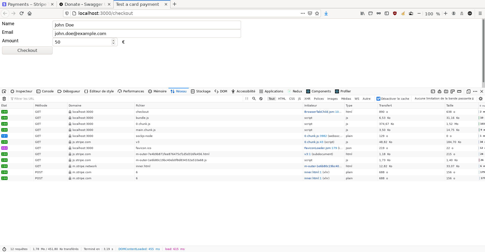
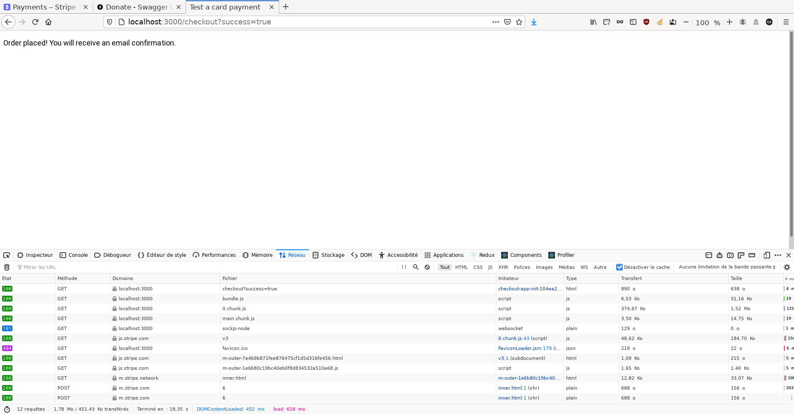

# Screenshots

## OpenAPI Swagger Documentation

## Create Donation

## Frontend Form

## Stripe Checkout

## Stripe Payments

## Stripe Payment

## Redirect to Frontend after Stripe Checkout Completed

## OAuth2 Login in OpenAPI

# OAuth2 logged

# Donations Query

